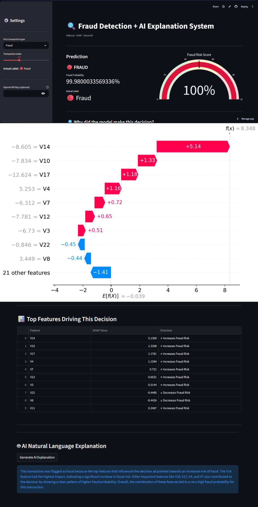

# 🔍 Fraud Detection + AI Explanation System

> Most fraud detection projects stop at **"fraud or not fraud."** This one goes further — it tells you **why**, in plain English.

[](https://fraud-detection-ai-explanation-system-azim.streamlit.app)


---

## 🚀 Live Demo

👉 **[fraud-detection-ai-explanation-system-azim.streamlit.app](https://fraud-detection-ai-explanation-system-azim.streamlit.app)**

---

## 📸 App Preview



*Fraud probability score · SHAP feature importance · GPT-generated plain English explanation*

---

## ✨ What Makes This Different

| Typical fraud detector | This project |
|---|---|
| Outputs "fraud" or "not fraud" | Outputs fraud probability + **why it was flagged** |
| Black-box model | Full SHAP explainability per transaction |
| No context for analyst | GPT-3.5 generates a plain English explanation |
| Hard to demo | Live Streamlit app with real transaction samples |

The **AI Explanation layer** is the core differentiator. Every flagged transaction gets a human-readable reason like: *"This transaction was flagged primarily due to an unusually high transaction amount relative to the account's typical behavior, combined with an atypical transaction time."*

---

## 📌 Overview

Built on the real-world [Kaggle Credit Card Fraud dataset](https://www.kaggle.com/datasets/mlg-ulb/creditcardfraud) with **284,807 transactions** (only 0.17% fraud), this system:

- Detects fraud with **97.76% ROC-AUC**
- Uses **SHAP** to explain which features drove each decision
- Generates a **natural language explanation** via OpenAI GPT-3.5
- Serves everything through an interactive **Streamlit dashboard**

---

## 📊 Model Performance

| Metric | Score |
|---|---|
| ROC-AUC | **0.9776** |
| Average Precision | **0.8663** |
| Fraud Recall | **90%** |
| Fraud Missed (FN) | 10 out of 98 |
| Legit Wrongly Flagged (FP) | 86 out of 56,864 |

---

## 🏗️ How It Works

```
Credit Card Transaction
        ↓
  XGBoost Model  →  Fraud Probability Score
        ↓
   SHAP Explainer  →  Feature-level importance
        ↓
  OpenAI GPT-3.5  →  Plain English explanation
        ↓
   Streamlit App  →  Interactive dashboard
```

**Key design decisions:**
- Used **SMOTE** (not downsampling) to handle class imbalance — preserves all 284k legitimate transactions
- SHAP applied only on test set — no data leakage
- Explainability layer sits on top of a production-grade XGBoost pipeline

---

## 🛠️ Tech Stack

| Layer | Technology |
|---|---|
| Model | XGBoost |
| Explainability | SHAP TreeExplainer |
| NLP Explanation | OpenAI GPT-3.5 |
| Imbalance Handling | SMOTE (imbalanced-learn) |
| Frontend | Streamlit |
| Data Processing | Pandas, NumPy, Scikit-learn |

---

## 📁 Project Structure

```
Fraud-Detection-AI-Explanation-System/
├── app.py                  ← Streamlit dashboard
├── requirements.txt        ← Dependencies
├── screenshot.png          ← App preview
├── demo.gif                ← Demo walkthrough
└── model/
    ├── xgb_model.pkl       ← Trained XGBoost model
    ├── shap_explainer.pkl  ← SHAP TreeExplainer
    ├── scaler.pkl          ← StandardScaler for Amount & Time
    └── test_samples.csv    ← Demo transactions (500 legit + 98 fraud)
```

---

## 💻 Run Locally

```bash
# 1. Clone the repo
git clone https://github.com/Azim521/Fraud-Detection-AI-Explanation-System.git
cd Fraud-Detection-AI-Explanation-System

# 2. Install dependencies
pip install -r requirements.txt

# 3. Add your OpenAI key
echo 'OPENAI_API_KEY = "sk-your-key-here"' > .streamlit/secrets.toml

# 4. Run the app
streamlit run app.py
```

---

## 📬 Contact

Built by **Azim Sadath**

[](https://www.linkedin.com/in/azim-sadath-a3ba34321/)
[](https://github.com/Azim521)
[](mailto:azimsadath521@gmail.com)
